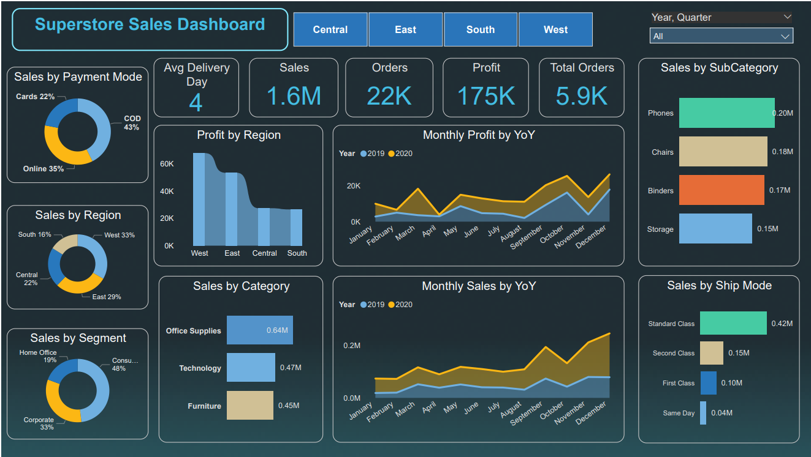
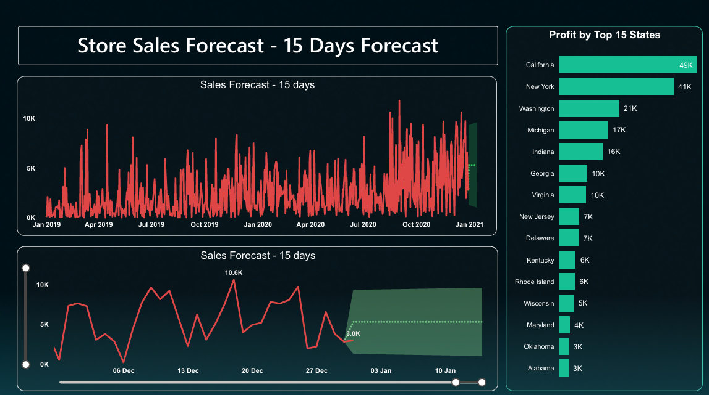

# 📊 Sales Analysis & 15-Day Forecast (Power BI Project)

This Power BI project provides a complete sales performance analysis using the SuperStore dataset, along with a 15-day sales forecast driven by Power BI’s time-series analytics and forecasting models.

The report focuses on key KPIs, trends, customer segments, and product categories to support business decision-making.

---

## 📸 Dashboard Previews

### **📌 Main Dashboard**
Provides overall business insights — Sales, Profit, Quantity, Customer Segments, Top States, and more.



### **📌 15-Day Forecast**
Visual prediction of upcoming sales using forecasting algorithms in Power BI.



---

## 📁 Repository Structure

```bash
## 📁 Repository Structure

powerbi-sales-analysis-and-forecasting/
│ 
├── reports/
│   ├── salesReport.pbix               # Power BI report file
│   ├── dashboard_overview.png         # Screenshot of the main dashboard
│   └── 15daysforecast.png             # Screenshot of the 15-day forecast
│
├── datasets/
│   └── SuperStore_Sales_Dataset.csv   # Dataset used in the report
│
└── README.md

```

---

## 🧾 Project Highlights

- Comprehensive **Sales Performance Analysis**
- KPI tracking: **Total Sales, Profit, Quantity**
- Breakdown by:
  - Region
  - Category & Sub-Category
  - Customer Segment
  - States & Cities
- **Time-Series Trend Analysis**
- **15-Day Sales Forecast** using Power BI’s built-in forecasting capabilities
- Clean visual storytelling using:
  - Cards  
  - Line charts  
  - Bar charts  
  - Map visualization  
  - Forecast visuals  

---

## 🛠 How to Use This Report

1. Download the **PBIX file**:  
   `reports/salesReport.pbix`

2. Open it in **Power BI Desktop**.

3. To refresh the report with your own dataset:
   - Go to **Home → Transform Data**.
   - Open **Data Source Settings**.
   - Click **Change Source** and select your own CSV/Excel file.
   - Click **Close & Apply**.
   - Press **Refresh** in Power BI.

4. All visuals will update automatically.

---

## 📂 Dataset Used

- File: `SuperStore_Sales_Dataset.csv`
- Contains fields such as:
  - Order Date  
  - Sales  
  - Profit  
  - Category / Sub-Category  
  - Region  
  - Customer Segment  
  - State / City  
  - Ship Mode  
  - Quantity  

*(No personal or sensitive data included.)*

---

## 🚀 About This Project

This project is designed to demonstrate:
- Power BI dashboard design  
- Business analytics workflow  
- Sales forecasting  
- Data modelling  
- Storytelling with visuals  

---

## Copyright Notice

Copyright (c) 2025 Sumit Pal. All Rights Reserved.

This project is not licensed for external distribution, modification, or commercial use without express written permission from the copyright holder.

